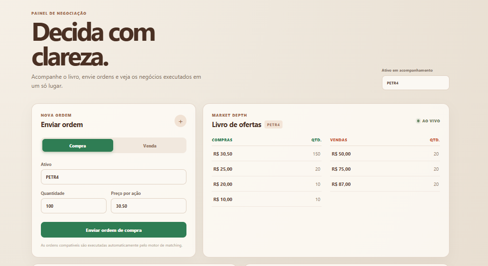
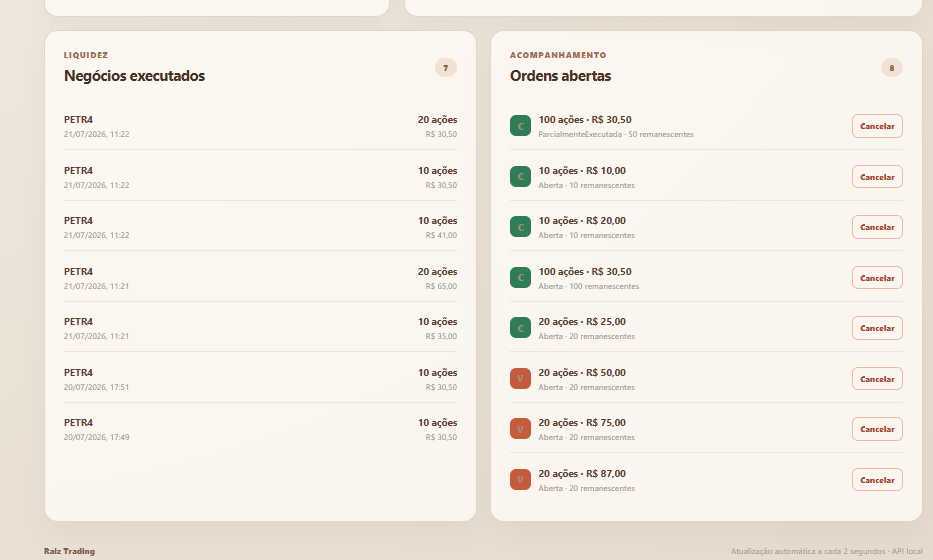

# Raiz Trading

Plataforma simplificada de negociação de ativos, desenvolvida como desafio técnico para praticar arquitetura de software, desenvolvimento de APIs, persistência, testes, Docker e integração entre backend e frontend.

> O projeto continua em construção e sendo evoluído incrementalmente, com melhorias planejadas para regras de negócio, cobertura de testes, experiência do usuário e observabilidade.

## Visão geral

A aplicação permite:

- Criar ordens de compra e venda.
- Executar ordens compatíveis por meio do motor de matching.
- Suportar execução parcial.
- Consultar ordens e seus status.
- Consultar o livro de ofertas.
- Consultar trades executados.
- Cancelar ordens abertas ou parcialmente executadas.
- Acompanhar os dados por uma interface web responsiva.

## Tecnologias

### Backend

- .NET 8 e ASP.NET Core Web API.
- C#.
- Entity Framework Core.
- PostgreSQL.
- Swagger/OpenAPI.
- Testes unitários e de integração.
- Arquitetura em camadas com API, Application, Domain e Infrastructure.

### Frontend

- React 18.
- TypeScript.
- Vite.
- Vitest.
- React Testing Library.
- Interface responsiva com identidade visual em tons terrosos.
- Verde para operações de compra e vermelho/laranja para operações de venda, seguindo convenções de usabilidade de plataformas de negociação.

### Infraestrutura

- Docker.
- Docker Compose.
- PostgreSQL em container com volume persistente.
- Healthcheck para o banco de dados.

## Frontend

A interface permite enviar ordens, acompanhar o livro de ofertas, visualizar trades executados e cancelar ordens abertas.



### Trades executados e ordens abertas



## Arquitetura

```text
backend/
├── src/
│   └── Trading.Api/
│       ├── Controllers/
│       ├── DTOs/
│       ├── Services/
│       ├── Repositories/
│       └── Program.cs
└── tests/
    ├── Trading.Domain.Tests/
    └── Trading.IntegrationTests/

frontend/
├── src/
│   ├── App.tsx
│   ├── api.ts
│   ├── styles.css
│   ├── App.test.tsx
│   └── api.test.ts
└── vitest.config.ts
```

## Principais rotas

| Método | Rota | Descrição |
|---|---|---|
| `GET` | `/health` | Verifica se a API está disponível |
| `POST` | `/orders` | Cria uma ordem |
| `GET` | `/orders` | Lista ordens, com filtro opcional por ativo |
| `GET` | `/orders/{id}` | Consulta uma ordem específica |
| `POST` | `/orders/{id}/cancel` | Cancela uma ordem |
| `GET` | `/orderbook/{ativo}` | Consulta o livro de ofertas |
| `GET` | `/trades` | Lista trades executados |
| `POST` | `/admin/reset` | Limpa dados para testes automatizados |

## Exemplo de criação de ordem

```json
{
  "tipo": "Compra",
  "ativo": "PETR4",
  "quantidade": 100,
  "preco": 30.50
}
```

Os enums são enviados como texto (`Compra`, `Venda`, `Aberta`, `ParcialmenteExecutada`, `Executada` e `Cancelada`) e as datas são tratadas em UTC.

## Como executar com Docker

Na raiz do projeto:

```powershell
docker compose up --build
```

Endereços locais:

- Frontend: <http://localhost:3000>
- API: <http://localhost:8080>
- Swagger: <http://localhost:8080/swagger>
- Health check: <http://localhost:8080/health>
- PostgreSQL: `localhost:5432`

Para parar os serviços:

```powershell
docker compose down
```

## Como executar o frontend separadamente

```powershell
cd frontend
npm.cmd install
npm.cmd run dev
```

Por padrão, o frontend utiliza a API em `http://localhost:8080`. Para alterar:

```powershell
$env:VITE_API_URL = "http://localhost:8080"
npm.cmd run dev
```

## Testes do frontend

```powershell
cd frontend
npm.cmd test
```

Os testes cobrem o cliente HTTP, criação e cancelamento de ordens, tratamento de erros, carregamento do livro, trades, validação do formulário e alternância entre compra e venda.

## Aprendizados e próximos passos

O desenvolvimento permitiu praticar separação de responsabilidades, arquitetura em camadas, DTOs, validações, tratamento de erros, valores monetários, datas UTC, integração entre containers, testes automatizados e construção de uma interface orientada à usabilidade.

A inteligência artificial também é utilizada como apoio durante a construção, especialmente para explorar soluções, revisar decisões, identificar problemas e acelerar o aprendizado, sempre com validação e entendimento do código implementado.

Entre as próximas melhorias estão ampliar a cobertura de testes, revisar regras de negócio, adicionar observabilidade, aperfeiçoar o tratamento de erros e evoluir a experiência do usuário.
